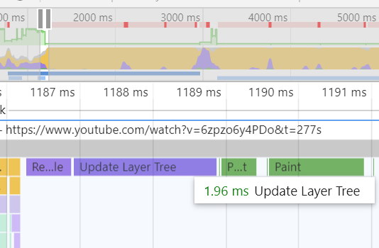
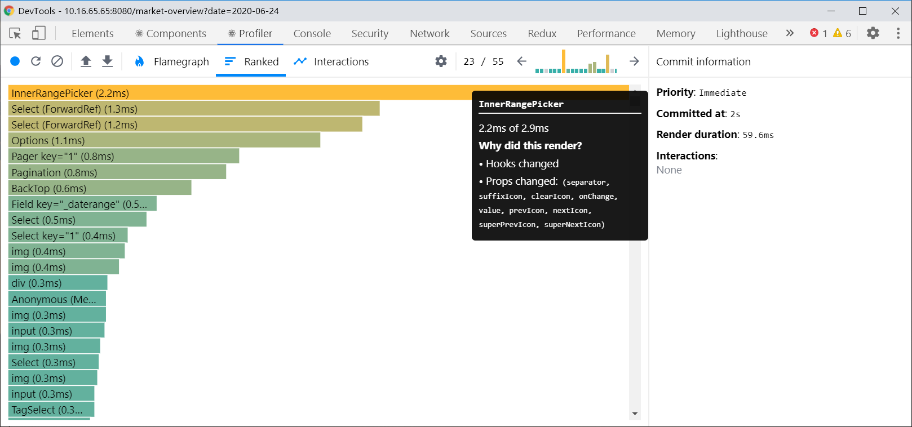

## 当谈论到优化react性能时,通常在指什么?

广义上讲, 优化react性能涉及如下方面
- service workers
- lazy loading images
- code splitting
- minification
- tree shaking

不过, 上面这些都是load time performance, 本篇在于只讨论runtime performance.

> 该怎么知道你的react程序有性能问题呢?

> 事实上, 或许你不需要. 大部分情况下, 细微的性能问题感受不出来. 当代设备计算能力很强, 一般的性能问题都感觉不出来, 就算体会得到, 这通常也不个大问题. 毕竟, 不要过早的优化还没有明显问题的代码.

当遇到卡顿现象时, 就能感受到性能问题, 遇到时, 打开浏览器devtools-performance.
最上面箭头指向的一行是fps(帧数), 绿色时一切正常, 红色时糟糕透顶几乎为0.
下面箭头指向的则是主线程的情况, 右上角标记为红色意味着这是一个long task, 这段卡顿的时间将极大的降低用户体验: 界面僵住, 无法进行点击按钮之类的任何交互. 一般来说, 可明显感知到的卡顿为100ms. 

## 如何优化运行时性能?

- 确定问题存在位置
- 估计卡顿时间
- 改进
- 打开dep tools
- 重复上述步骤直到可确认性能没有问题

当动画以60帧运行时, 一帧时长为16.66ms, 在dev tools的frames一行中可以看到每一帧的情况, 点击具体某一帧还可查看详细信息.

`Main`中的所有任务于鼠标hover上时都会显示运行的任务详情与耗时.

`timings`中可以看到User Timings, 图中react已经用User Timings API(performance.mark 与 performance.measure) 对内部的一些关键步骤定义了标记和说明, 这比看`frames`和`main`那两项要直观得多.

## React中的常见性能问题
- 最最常见的情况: 由于依赖导致的不必要渲染
- React并没有默认对重渲染进行处理: 未进行任何处理时, 界面上一个组件视觉上有明显变化, 那么React将会重新渲染它的所有子组件
- React在渲染大量组件时的性能并不怎么样 

观察性能的另一个好方法: 在React development tools - Profiler里查看

memo/PureComponent, 用hooks方法缓存没必要改变的值.

## list are everywhere 
list virtualization

`react-window`

## cpu pref problems
- web apps run on the main thread
- UI generally runs on the main thread
- non trivial cpu intensive tasks can stall your apps interactivity

Web Workers